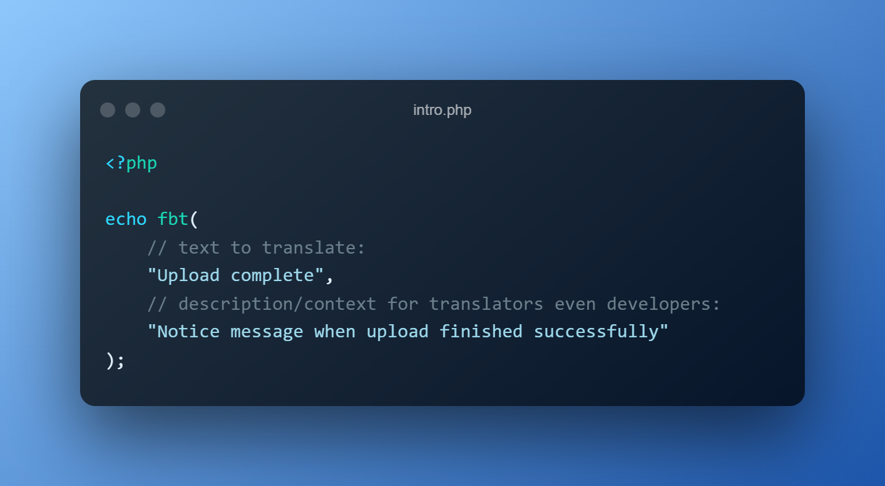
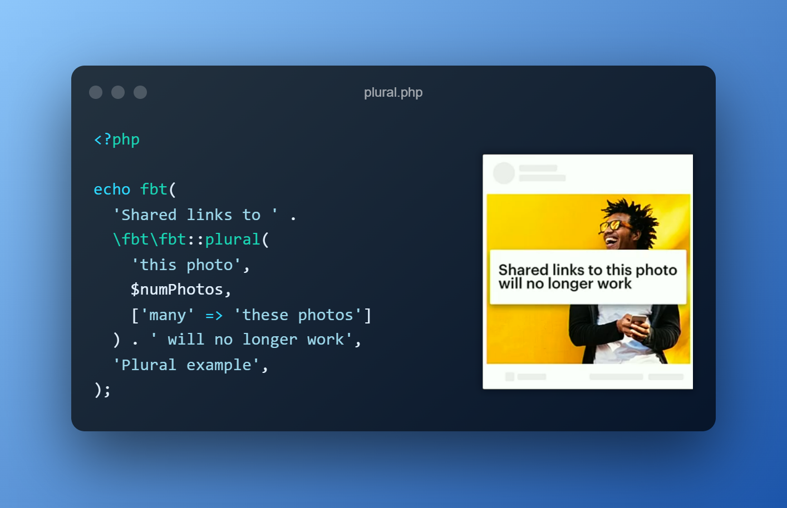
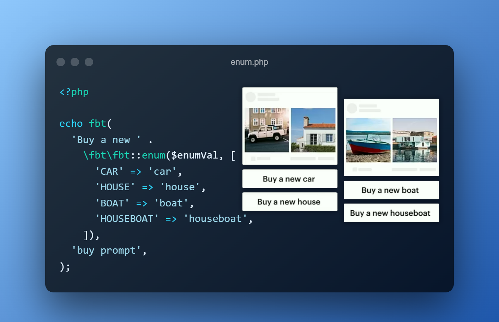
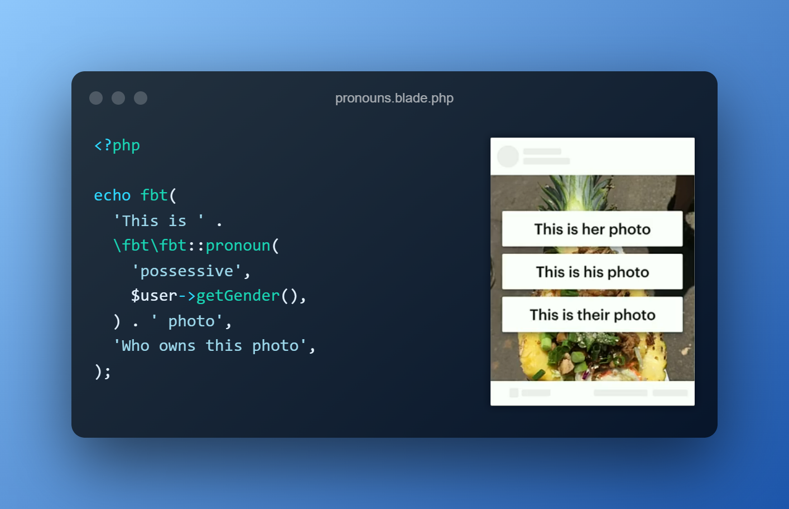

<h1 align="center">
  
</h1>

# FBT for PHP

[](https://packagist.org/packages/richardDobron/fbt)
[](LICENSE.md)


[](https://packagist.org/packages/richardDobron/fbt)

FBT is an internationalization framework for PHP designed to be not just **powerful** and **flexible**, but also **simple** and **intuitive**.  It helps with the following:
* Organizing your source text for translation
* Composing grammatically correct translatable UI
* Eliminating verbose boilerplate for generating UI

**This library is based on the JavaScript implementation of Facebook's [FBT][link-facebook-fbt].**






## 📖 Requirements
* PHP 7.0 or higher
* [Composer](https://getcomposer.org) is required for installation

## 📦 Installing

```shell
$ composer require richarddobron/fbt:^3
```

## ✨ Features
- [x] Parameters and interpolation
- [x] Implicit parameters
- [x] Auto-parameterization
- [x] Plurals
- [x] Enumerations
- [x] Pronouns
- [x] Number formatting
- [x] Phrase extracting
- [x] Inline translating

## 🚀 Getting started

See the [Getting Started](docs/getting_started.md) guide for more.

## 📑 Version Guidance

| Version | Released   | Status | Repo             | PHP Version |
|---------|------------|--------|------------------|-------------|
| 3.x     | 2022-02-18 | Latest | [v3][fbt-3-repo] | >= 7.0      |

## 🔌 Official integrations

The following integrations are fully supported and maintained:

- [Laravel](https://github.com/richardDobron/laravel-fbt)

## ⚙️ How FBT works
FBT works by transforming your `<fbt>` and `fbt(...)` constructs via
[Simple HTML DOM Parser][simplehtmldom].  It serves to extract strings from source and
lookup translated payloads generated during execution.  FBT creates tables
of all possible variations for each fbt phrase and accesses them
at runtime.

## 📕 Full documentation

- [API Reference](https://richarddobron.github.io/fbt/)

## ✅ TODO

- [ ] Add driver-agnostic support for multiple database systems.
- [ ] Add integrations for Symfony, CakePHP, Zend Framework, ...
- ...

## 🤝 Contributing

We welcome contributions! If you'd like to help improve this project, feel free to open an issue or submit a pull request.

## 📜 License
FBT is MIT licensed, as found in the [LICENSE](LICENSE) file.

[fbt-3-repo]: https://github.com/richarddobron/fbt
[link-facebook-fbt]: https://github.com/facebook/fbt
[simplehtmldom]: https://sourceforge.net/projects/simplehtmldom/files/simplehtmldom/1.9.1/
